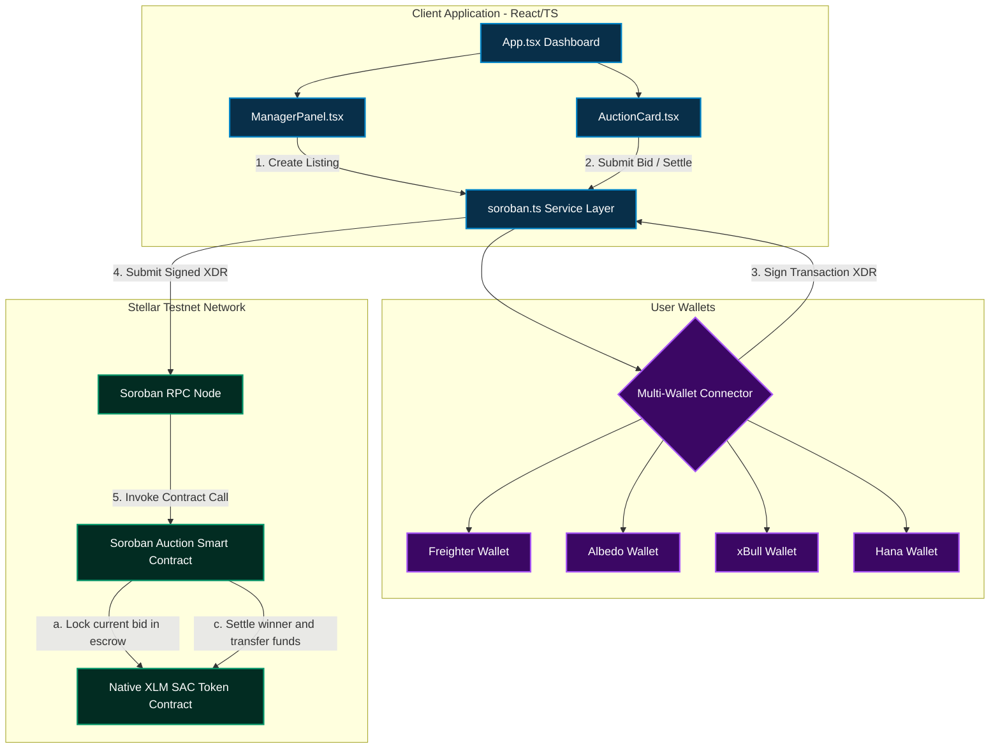

# 🔨 OnChainAuction

[](https://stellar.org)
[](https://soroban.stellar.org)
[](https://opensource.org/licenses/MIT)
[](https://github.com/ankush-shaw/On-Chain-Auction/actions)

A decentralized, on-chain project bidding and auction platform built on **Stellar Soroban**. Project managers list project opportunities directly to the blockchain, and public bidders submit trustless XLM-backed bids in real-time. The smart contract holds the active highest bid, refunds the previous bidder instantly and automatically, and securely transfers the winning bid to the seller upon auction settlement.

---

## 📽️ Visual Walkthrough (App Preview)

*(Add screenshots, GIFs, or embedded video links here to showcase your application)*

#### ☀️ Light (Cream) Mode & Bidding Board


#### 🌙 Dark Mode & Manager Console


### Mobile Responsive view


---

## 🏆 Project Submission Details

| Item | Value |
|:---|:---|
| **Live Demo** | [https://onchain-auction.vercel.app/](https://onchain-auction.vercel.app/)  |
| **Demo Video** | [Watch Demo Video](https://drive.google.com/file/d/YOUR_VIDEO_ID_HERE/view?usp=sharing) *(insert link to screen recording)* |
| **Pitch Deck / PPT** | [View Pitch Deck](https://docs.google.com/presentation/d/YOUR_PPT_ID_HERE/edit?usp=sharing) *(insert link to deck)* |
| **Contract ID** | `CAFY23YICS2EP3QXMPGBPGBN5UMNERVOE453BEIZDYNNW2JXLDKVX5SY` |
| **Network** | Stellar Testnet |
| **Explorer** | [View on Stellar.Expert](https://stellar.expert/explorer/testnet/contract/CAFY23YICS2EP3QXMPGBPGBN5UMNERVOE453BEIZDYNNW2JXLDKVX5SY) |
| **Bidding Token** | Native XLM |
| **Commits** | Meaningful commits with structured history — [View Git Commit History](https://github.com/ankush-shaw/On-Chain-Auction/commits/main) |

---

## 👥 User Onboarding & Testnet Validation

We successfully gathered feedback from real testnet users to validate our decentralized bidding experience and gathered structured suggestions to refine the product.

*   **📋 Feedback Form:** [Fill out the Google Form](https://docs.google.com/forms/d/e/1FAIpQLSfa45WCSx3aEYmMvyQZ4n-ZnO_2xJQUBZ9nzoFQ_b8zdR9UPQ/viewform?usp=sharing&ouid=104656030980064295821)
*   **📊 Live Responses Database:** [View Responses Spreadsheet](https://docs.google.com/spreadsheets/d/1TpOJGbwcuay3qbAOZRUt4OgfbKvadTW553FGRyVml2Y/edit?usp=sharing)

### ✅ Verification of Testnet Activity

Users interacted directly with our deployed Soroban contract on the Stellar Testnet. You can inspect all verified on-chain transactions and call history at:

**[→ View Deployed Contract on Stellar.Expert Explorer](https://stellar.expert/explorer/testnet/contract/CAFY23YICS2EP3QXMPGBPGBN5UMNERVOE453BEIZDYNNW2JXLDKVX5SY)**

---

## 🔄 User Feedback — Completed Iterations

Based on structured feedback collected during initial user onboarding phases, we completed major development iterations to address UX, accessibility, and wallet security:

### 🔹 Iteration 1: Light Mode Aesthetic Overhaul (Soft Cream Theme)
*   **Feedback Received:** *"The default bright white light mode is extremely harsh and causes eye fatigue when viewing bid charts and project boards."*
*   **What We Did:** Designed and implemented a custom `cream` color system (`cream-50` to `cream-400`). Replaced the pure white layout with a warm, low-contrast cream palette (`#faf6ef` background, `#fefcf8` card panels, `#e8dbc5` borders) to maximize readability and reduce visual strain.
*   **Git Commit:** [Design: Update light mode to use soft warm cream tones](https://github.com/ankush-shaw/On-Chain-Auction/commit/46ff03e)

### 🔹 Iteration 2: Unified Multi-Wallet Integration
*   **Feedback Received:** *"Bidders use different browser wallets to store testnet XLM. Restricting login options to Freighter makes it difficult to participate."*
*   **What We Did:** Implemented native support for **Freighter**, **Albedo**, **xBull**, and **Hana** extension wallets. Built a robust transaction signing utility that handles different wallet formats seamlessly and auto-refreshes account balances.
*   **Git Commit:** [feat: Added Darkmode - Lightmode feature across the website](https://github.com/ankush-shaw/On-Chain-Auction/commit/46ff03e)

### 🔹 Iteration 3: Mobile Responsiveness & Text Truncation
*   **Feedback Received:** *"The auction cards break when viewed on standard smartphones, and long cryptographic seller addresses push buttons off-screen."*
*   **What We Did:** Made the layout fully responsive. Bidding rows now stack cleanly on mobile (`flex-col`) and expand side-by-side on wider displays. Long seller/bidder addresses are truncated to an elegant prefix/suffix format (`GBSG12...ABC123`) using clean CSS grids with full fallback hover tooltips.
*   **Git Commit:** [Feat: Added responsiveness across the the whole app](https://github.com/ankush-shaw/On-Chain-Auction/commit/b39add1)

### 🔹 Iteration 4: Auto-Refunding Smart Contract Safety
*   **Feedback Received:** *"I want to be sure that when I am outbid, my locked XLM funds are immediately returned to my wallet without manual withdrawal."*
*   **What We Did:** Optimized the Rust Soroban contract's `place_bid` method. Whenever a higher bid is registered, the contract instantly initiates a transfer callback returning the previous bidder's funds synchronously in the same transaction block.
*   **Git Commit:** [chore: update contract bindings & frontend wrappers](https://github.com/ankush-shaw/On-Chain-Auction/commit/caa45d5)

---

## 🚀 Future Evolution Plan (Next Phase)

| Priority | Improvement | Driven By |
|:---|:---|:---|
| 🔴 High | Add automated email/browser alerts when a user gets outbid | User feedback: "I missed the close because I didn't know I was outbid" |
| 🟡 Medium | Support custom SAC (Stellar Asset Contract) tokens instead of only native XLM | Listing feedback: "We want to hold auctions using our custom project tokens" |
| 🟢 Low | Visual bid history charts showing bidding velocity over time | UX suggestion: "Would love to see a chart of price updates" |

---

## 🛠️ Technology Stack

| Layer | Technology |
|---|---|
| **Frontend** | React (TypeScript), Vite, Tailwind CSS, Framer Motion, Lucide Icons |
| **Blockchain** | Stellar Testnet, Soroban Smart Contracts |
| **Smart Contract** | Rust (WASM target), Soroban Contract SDK |
| **Wallets** | Freighter API, Albedo Intent API, xBull SDK, Hana Wallet |
| **CI/CD** | GitHub Actions (automated compilation & test verification) |

---

## 📐 System Architecture & Bidding Flow

Below is the design of the OnChainAuction platform, illustrating how the React frontend interacts with multi-wallets and submits contract invocations to the Stellar Soroban network:



---
## 📜 Smart Contract API

The core contract source code is located in [`contracts/auction-contract`](file:///c:/Users/ankus/OneDrive/Desktop/FUN%20PROJECTS/Stellar%20wallet%20project/contracts/auction-contract).

| Function | Arguments | Description |
|---|---|---|
| **`create_auction`** | `seller: Address`, `token: Address`, `id: u32`, `title: String`, `description: String`, `starting_bid: i128`, `duration_seconds: u64` | Registers a new auction on-chain with target parameters and duration. |
| **`get_auction`** | `id: u32` | Retrieves details and active bid info for the given auction ID. |
| **`get_auction_count`** | *None* | Returns the total count of registered auctions. |
| **`place_bid`** | `bidder: Address`, `id: u32`, `amount: i128` | Submits a new highest bid. Safely locks new funds and refunds the previous bidder. |
| **`settle_auction`** | `id: u32` | Finalizes the auction (must be ended). Transfers the locked highest bid to the seller. |

---

## ⚙️ Local Development Setup

### Prerequisites
*   [Node.js](https://nodejs.org/) (v18+)
*   [Rust & Cargo](https://www.rust-lang.org/) with `wasm32-unknown-unknown` target
*   [Stellar CLI](https://developers.stellar.org/docs/build/smart-contracts/getting-started/setup)

### 1. Installation
Clone the repository and install the dependencies from the project root:
```bash
npm install
```

### 2. Local Environment Configuration
Create a `.env` file in the root of the project to declare your environment parameters:
```env
VITE_AUCTION_CONTRACT_ID=YOUR_DEPLOYED_CONTRACT_ID
VITE_STELLAR_RPC_URL=https://soroban-testnet.stellar.org
VITE_NATIVE_TOKEN_CONTRACT_ID=CDLZFC3SYJYDZT7K67VZ75HPJVIEUVNIXF47ZG2FB2RMQQVU2HHGCYSC
```

### 3. Run the Frontend
Launch the local dev server:
```bash
npm run dev
```
Open your browser and navigate to `http://localhost:5173`.

---

## 🧪 Smart Contract Testing

The smart contract includes complete unit tests verifying the auction creation, bidding limits, refunds, and final settlements. Run the test suite:

```bash
cargo test -p auction-contract
```

All unit tests run and pass locally:
```
running 3 tests
test test::test_create_auction ... ok
test test::test_place_bid_refunds_previous_bidder ... ok
test test::test_settle_auction_transfers_winning_bid_to_seller ... ok

test result: ok. 3 passed; 0 failed; 0 ignored; 0 measured; 0 filtered out; finished in 0.12s
```


---

## 🚢 Testnet Deployment Workflow

### 1. Build the WASM Contract
Build the Rust smart contract in release mode from the repository root:
```bash
stellar contract build --package auction-contract
```

### 2. Run the Deployment Script
To build the WASM, deploy the contract to Stellar Testnet, instantiate it, and seed 3 sample listings on-chain in a single command, run:
```bash
npm run deploy:contract
```

#### Fast Deployment Option (Skip Seeding)
To deploy the contract without adding the sample auctions:
```powershell
# Windows
$env:SKIP_SEED="1"; npm run deploy:contract

# Linux / macOS
SKIP_SEED=1 npm run deploy:contract
```

---

## 📁 Repository Directory Structure

```
/
├── .github/workflows/        # Automated CI/CD Actions workflows
├── contracts/
│   └── auction-contract/     # Soroban smart contract source (Rust)
│       ├── src/
│       │   ├── lib.rs        # Main contract logic & API
│       │   └── test.rs       # Comprehensive unit tests
│       └── Cargo.toml
├── src/                       # React frontend source
│   ├── components/
│   │   ├── AuctionCard.tsx    # Bidding card with active timer & inputs
│   │   ├── ManagerPanel.tsx   # Dashboard tool for listing new projects
│   │   └── WalletConnect.tsx  # Interactive multi-wallet selector & logout
│   ├── hooks/
│   │   ├── useWallet.ts       # React state hook for Freighter, Albedo, xBull, Hana
│   │   └── useTheme.ts        # React hook for persistent light/dark cream mode
│   ├── services/
│   │   └── soroban.ts         # Stellar SDK transaction builders & RPC server calls
│   ├── types/
│   │   └── index.ts           # Shared TypeScript interfaces
│   └── App.tsx                # Main layout, theme toggles, and state manager
├── deploy-auction.js          # Deployment & seeding automation script (Stellar CLI wrapper)
├── package.json               # Development scripts & dependencies configuration
├── vite.config.ts             # Vite server config with Node polyfills
├── tailwind.config.js         # CSS design utility parameters with cream mode configurations
├── tsconfig.json              # TypeScript compilation rules
└── README.md                  # Project documentation
```
